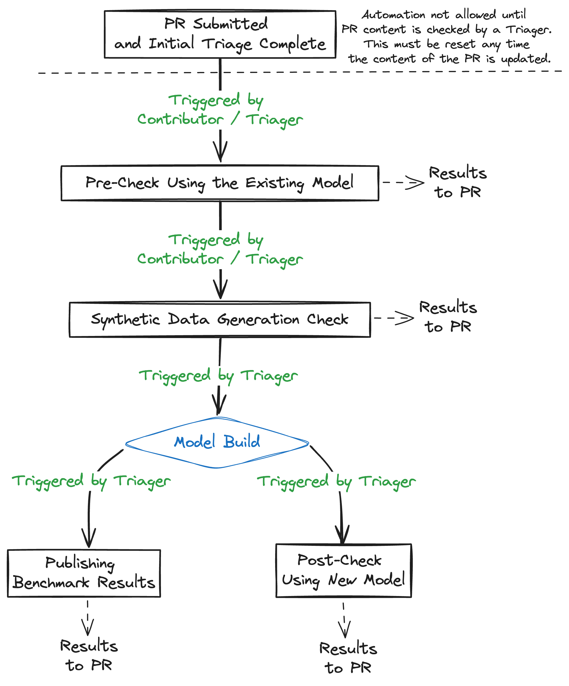

# GitHub Automation for Taxonomy

This document describes the GitHub automation used with the
[Taxonomy](https://github.com/instruct-lab/taxonomy) repository.



## Key Components

### InstructLab Bot

There is a [GitHub bot](https://github.com/instruct-lab/instruct-lab-bot) used
to facilitate this automation. This bot receives GitHub events and performs
actions on behalf of different components within Instruct Lab. More details on
the architecture of the bot itself can be found in its repository.

### GitHub Actions

Not everything needs to be orchestrated by an external bot. The bot is good for
facilitating user interactions and managing long-running tasks on custom
infrastructure. However, many simpler tasks should just be GitHub actions. These
are easier to write and maintain, and they can be triggered by a variety of
events.

### Mergify (future)

[Mergify](https://docs.mergify.com) is a tool that can perform workflow
automation for a GitHub repository. It can be used to implement a variety of
automation tasks, such as automatically merging PRs when certain conditions are
met. While not yet in use, it should be kept in mind for future needs.

## Points of Interaction

### Access Controls

Team membership for triagers of the Taxonomy repository is managed using the
[taxonomy-triagers GitHub
team](https://github.com/orgs/instruct-lab/teams/taxonomy-triagers).

The bot should allow configuring a list of GitHub teams that are allowed to
enable its functionality on a PR. The first command will only be accessible to
the following teams:

- Taxonomy Triagers
- Taxonomy Maintainers
- Backend Maintainers
- Instruct Lab Org Admins

This first command is used to indicate that a PR has been reviewed enough to determine
that it is safe to run automated tasks against it. This is to help avoid abuse
of our backend resources with malicious PRs.

```
@instruct-lab-bot enable
```

If the bot determines the author of this command is in one of the required
teams, it will set a [commit
status](https://docs.github.com/en/rest/commits/statuses) on the PR indicating
that the bot functionality is turned on. The use of commit status here is
important because commit status will automatically be reset if the author of
the PR makes further changes. Any changes should require another check by a
triager or maintainer for the bot to be re-enabled.

At this point, the bot should respond with a welcome message including a list of
commands that have been enabled for this PR (`precheck`, `generate`, for example).

* [Bot PR adding gating label support](https://github.com/instruct-lab/instruct-lab-bot/pull/120)

Two labels will be used:

* `skill` - This label indicates that the bot can run automation intended for skills PRs.
* `knowledge` - This label indicates that the bot can run automation intended for knowledge PRs.

### Pre-Check Using the Existing Model

The trigger for this step should be a PR comment with the following format:

```text
@instruct-lab-bot precheck
```

At this point, the bot will kick off a process that will run the questions from
the `qna.yaml` against the existing Merlinite model. The intent is to allow
contributors and reviewers to see if the proposed addition is already a
capability of the model by comparing the model's answers to the provided sample
answers.

When the process is complete, the bot will post a comment with instructions on
how to access the results.

* <https://github.com/instruct-lab/instruct-lab-bot/issues/85>

### Post-Check Using the Trained Model

The trigger for this step should be a PR comment with the following format:

```text
@instruct-lab-bot postcheck
```

At this point, the bot will kick off a process that will run the questions from
the `qna.yaml` against the new Merlinite model. This will allow contributors and
triagers to see how the new model behaves for the sample questions.

The GitHub bot will manage this process, but the actual model training will be
done by the backend pipeline. The bot will hit an API endpoint that is serving
the new, candidate model. The exact API endpoint is a private endpoint hosted by
backend infrastructure.

When the process is complete, the bot will post a comment with instructions on
how to access the results.

* <https://github.com/instruct-lab/instruct-lab-bot/issues/127>

### Synthetic Data Generation Check

The trigger for this step should be a PR comment with the following format:

```text
@instruct-lab-bot generate
```

At this point, the bot will kick off a process that will generate a sample of
synthetic data generated by the Mixtral model. This is to allow contributors and
reviewers to determine if the synthetic data generated as a result of the
proposed addition is reasonable.

When the process is complete, the bot will post a comment with instructions on
how to access the results.

* Working, but still needs remote endpoint support added:
  <https://github.com/instruct-lab/instruct-lab-bot/issues/116>

